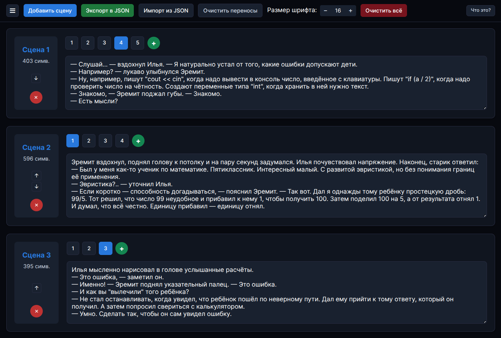
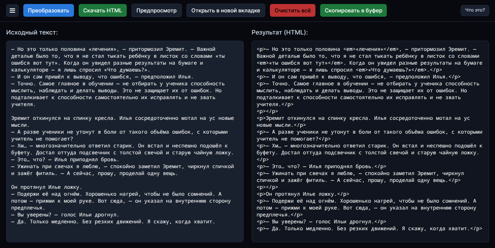
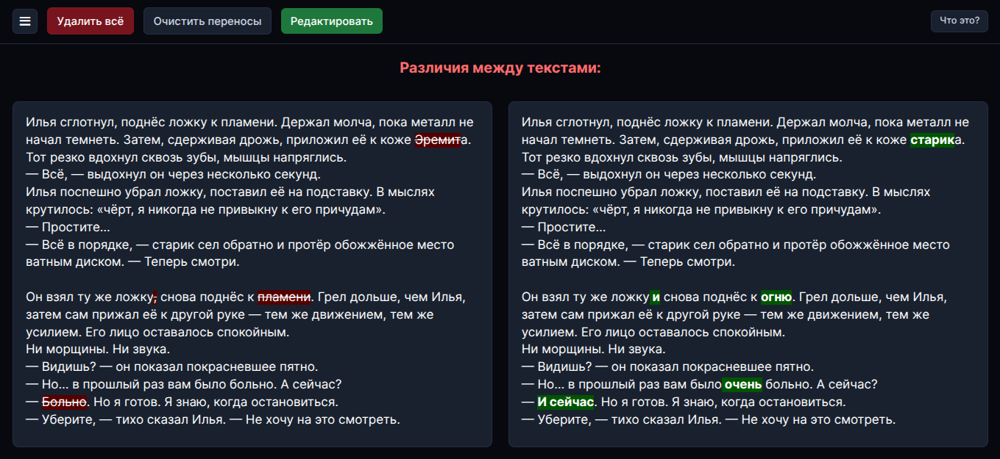
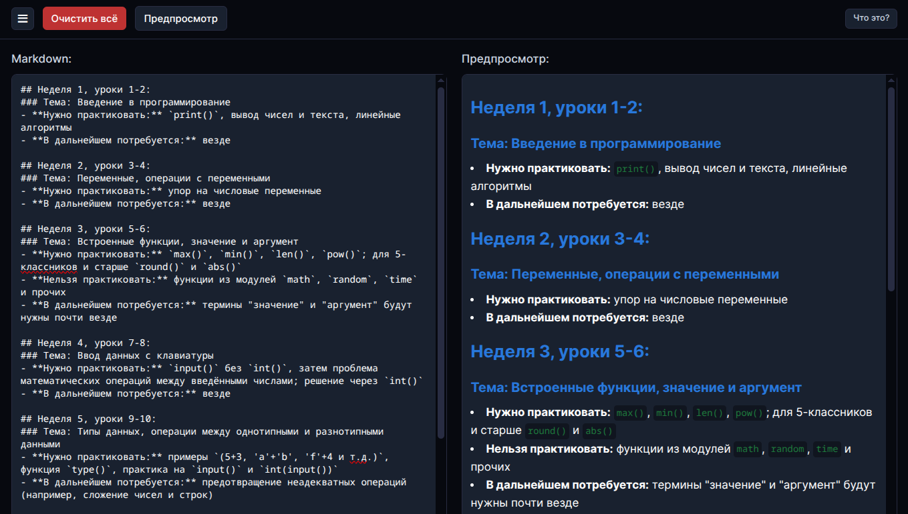
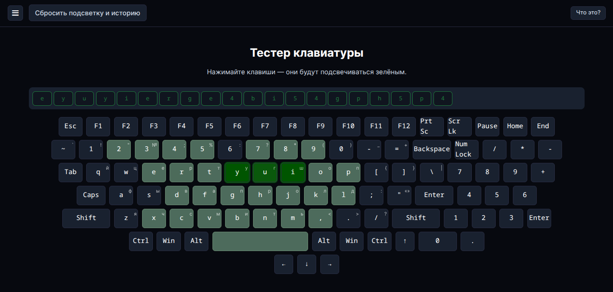

# React + Vite

This template provides a minimal setup to get React working in Vite with HMR and some ESLint rules.

Currently, two official plugins are available:

- [@vitejs/plugin-react](https://github.com/vitejs/vite-plugin-react/blob/main/packages/plugin-react) uses [Babel](https://babeljs.io/) for Fast Refresh
- [@vitejs/plugin-react-swc](https://github.com/vitejs/vite-plugin-react/blob/main/packages/plugin-react-swc) uses [SWC](https://swc.rs/) for Fast Refresh

## Expanding the ESLint configuration

If you are developing a production application, we recommend using TypeScript with type-aware lint rules enabled. Check out the [TS template](https://github.com/vitejs/vite/tree/main/packages/create-vite/template-react-ts) for information on how to integrate TypeScript and [`typescript-eslint`](https://typescript-eslint.io) in your project.
# 🖋️ Writer Toolkit

Набор личных инструментов для писателей и редакторов, созданный для повышения продуктивности при работе с текстом.

> «Иногда лучший редактор — это тот, что ты написал сам».

---

## 🧰 Модули

### 🎬 Редактор сцен
Управляйте сценариями с поддержкой нескольких вариантов текста на сцену.  
- Добавляйте/удаляйте сцены и варианты  
- Переименовывайте сцены по клику  
- Экспортируйте/импортируйте в JSON  
- Автосохранение в браузере

### 🏷️ HTML-теггер
Преобразует «сырой» текст в HTML-разметку:  
- Каждая строка → `<p>...</p>`  
- Текст в кавычках «...» → `<em>«...»</em>`  
- Поддержка многострочных кавычек  
- Предпросмотр результата и экспорт в `.html`

### 🔍 Детектор различий
Сравнивает два текста и визуально выделяет изменения:  
- Добавленное — зелёным  
- Удалённое — красным  
- Сообщение при полном совпадении  
- Автоматический перенос длинных строк

### 📝 Предпросмотр Markdown
Преобразует Markdown-разметку в HTML и отображает результат:  
- Поддержка основных элементов (жирный, курсив, заголовки, код, списки и т.д.)  
- Предварительный просмотр результата в реальном времени  
- Режим редактирования/предпросмотра  
- Очистка содержимого

### ⌨️ Тестер клавиатуры
Помогает диагностировать неисправные клавиши:  
- Подсветка нажатых клавиш  
- История последних 20 нажатий  
- Поддержка английской и русской раскладок  
- Визуальное отображение символов на клавишах

---

## 🚀 Установка и запуск

1. Клонируйте репозиторий:
   ```bash
   git clone https://github.com/Aumphaadr/WriterToolkit.git
   cd WriterToolkit
   ```

2. Установите зависимости:
   ```bash
   npm install
   ```

3. Запустите локальный сервер:
   ```bash
   npm run dev
   ```

4. Откройте в браузере: `http://localhost:5173` (порт может отличаться)

---

## 📦 Технологии

- **React** — основной фреймворк
- **Vite** — сборка и dev-сервер
- **react-router-dom** — навигация между модулями
- **diff-match-patch** — алгоритм сравнения текстов
- **marked** — алгоритм преобразования Markdown
- **dompurify** — очистка потенциально опасного HTML
- **localStorage** — автосохранение данных

---

## 📸 Скриншоты







---

## 📝 Лицензия

Этот проект распространяется под лицензией **MIT** — используйте, модифицируйте, делитесь.

---

## 💬 Обратная связь

Проект создан для личного использования, но если у вас есть идеи или вы нашли баг — [откройте issue](https://github.com/Aumphaadr/WriterToolkit/issues)!
